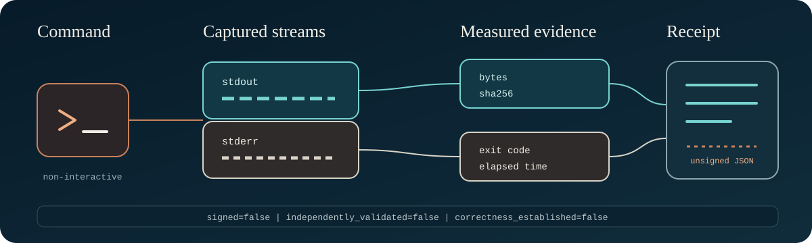

# receipt-run-lite

[](https://github.com/regsaddler/receipt-run-lite/actions/workflows/test.yml)

<p align="center">
  
</p>

A single-file, standard-library command wrapper that records what a process
actually returned: exit code, timing, byte counts, and SHA-256 hashes for
stdout and stderr.

It is intentionally small. For signed software-supply-chain attestations,
material/product rules, and delegated trust, use a mature system such as
[in-toto](https://in-toto.io/). This project is a transparent local receipt,
not a replacement for in-toto or SLSA provenance.

## Why it exists

"The test passed" is prose. A receipt makes the narrower observation
inspectable without pretending that a successful command proves correctness.

<p align="center">
  
</p>

## Use

```bash
python3 -B receipt_run.py \
  --output receipts/self-test.json \
  --label semantic-entropy-self-test \
  --timeout 120 \
  --max-output-bytes 8388608 \
  -- python3 -B semantic_entropy.py --self-test
```

The wrapper creates three files:

```text
receipts/self-test.json
receipts/self-test.stdout
receipts/self-test.stderr
```

It refuses to overwrite any existing receipt or stream path and refuses to
follow stream symlinks on platforms that expose `O_NOFOLLOW`. Output files are
created with owner-only permissions. Choose a new output name for every run.

Raw command arguments are omitted by default because command lines often
contain tokens or private paths. `--record-command` is an explicit opt-in.
Do not place secrets in command-line arguments: a hash is not a safe disguise
for a low-entropy secret.

Version 0.2 caps combined stdout and stderr at 8 MiB by default. Reaching the
cap terminates the command and records `output_limited`, the ceiling, and which
stream was truncated. The wrapper exits `3` whenever output was truncated,
even if a fast child had already exited `0`; the child's own exit code remains
in the receipt. `--max-output-bytes` changes the ceiling explicitly.
On POSIX systems, timeout and output-limit termination target the command's
new process group so ordinary descendants do not outlive the receipt runner.

## Test

```bash
python3 -B -m unittest discover -s tests -v
```

## What the receipt does not prove

The JSON is unsigned and produced by the same local executor that ran the
command. It does not establish identity, independent validation, scientific
correctness, safety, or authorization. It preserves an observation for later
review. Process-group termination is best-effort containment, not a security
sandbox: descendants that deliberately create a new session can escape it,
and non-POSIX systems fall back to terminating the direct process.

MIT License.
