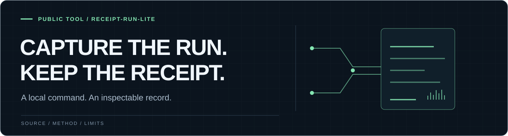

<p>
  
</p>

# receipt-run-lite

[](https://github.com/regsaddler/receipt-run-lite/actions/workflows/test.yml)

A single-file, standard-library command wrapper that records what a process
actually returned: exit code, timing, byte counts, and SHA-256 hashes for
stdout and stderr.

**An unsigned local observation. A successful command does not prove correctness.**

[Quickstart](#quickstart) · [How it works](#how-it-works) · [Limits](#what-the-receipt-does-not-prove)

---

## Quickstart

Use Git and Python 3.10 or newer. No third-party Python packages are required.

```bash
git clone https://github.com/regsaddler/receipt-run-lite.git
cd receipt-run-lite
python3 -B receipt_run.py \
  --output receipts/hello.json \
  --label hello-demo \
  -- python3 -c "print('hello')"
python3 -m json.tool receipts/hello.json
```

This self-contained example creates three files:

| File | Contents |
| --- | --- |
| `receipts/hello.json` | Exit status, timing, output sizes and hashes |
| `receipts/hello.stdout` | `hello` followed by a newline |
| `receipts/hello.stderr` | Empty for this example |

**Choose a new output name for every run.** The wrapper refuses to overwrite
any existing receipt or stream path. To record your own command, replace the
command after `--` and choose a fresh receipt path.

## How it works

"The test passed" is prose. A receipt makes the narrower observation
inspectable without pretending that a successful command proves correctness.

<p align="center">
  
</p>

### Output handling

Output files are created with owner-only permissions. The wrapper refuses to
follow stream symlinks on platforms that expose `O_NOFOLLOW`.

Raw command arguments are omitted by default because command lines often
contain tokens or private paths. `--record-command` is an explicit opt-in.
Captured stdout and stderr can still contain sensitive data; inspect them
before sharing. Do not place secrets in command-line arguments: a hash is not
a safe disguise for a low-entropy secret.

## Test

```bash
python3 -B -m unittest discover -s tests -v
```

---

## What the receipt does not prove

The JSON is unsigned and produced by the same local executor that ran the
command. It does not establish identity, independent validation, scientific
correctness, safety, or authorization. It preserves an observation for later
review. Timeout handling terminates the direct process only; this utility does
not provide process-tree isolation or a security sandbox.

For signed software-supply-chain attestations, material/product rules, and
delegated trust, use a mature system such as [in-toto](https://in-toto.io/).
This project is not a replacement for in-toto or SLSA provenance.

<details>
<summary>Receipt illustration</summary>

<p align="center">
  
</p>

</details>

MIT License.

---

<sub>PUBLIC RESEARCH TOOLS</sub>

[Reg Saddler](https://github.com/regsaddler) · [receipt-run-lite](https://github.com/regsaddler/receipt-run-lite) · [semantic-entropy](https://github.com/regsaddler/semantic-entropy) · [Difference Theory](https://differencetheory.com)
